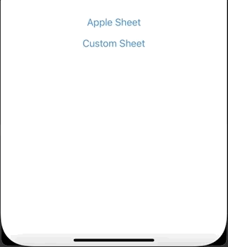

# SwiftUI Exploration

### Bottom Sheet

Sheet that presents a custom view from the bottom of the screen. 

ToDo: 
* Dismissable Background
* Ability to drag the view down
* Fix the safe area rendering

 

### Pulsing Activity Indicator

Activity Indicator that pulses/fades objects in sequence. You can pulse any type of view: Shapes, Images, Text, etc.

