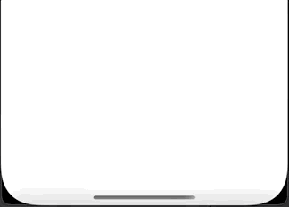

# SwiftUI Exploration

### Bottom Sheet

Sheet that presents a custom view from the bottom of the screen. 

Left to do (WIP):
- Dismissible Background
- Ability to drag the view down
- Fix the safe area rendering

 

### Buttons

Rectangle button with configurable parameters:
* Foreground Color
* Background Color
* Border Color
* Border Width
* Corner Radius
* Inner Padding

### Pulsing Activity Indicator

Activity Indicator that pulses/fades objects in sequence. You can pulse any type of view: Shapes, Images, Text, etc.

